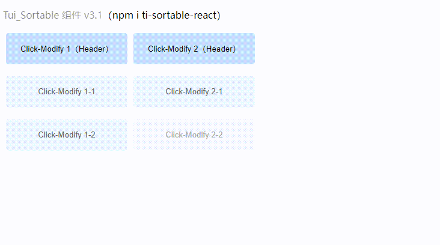

# ti-sortable-react
- an excellent React component for draggable grid layouts. It allows you to easily rearrange and edit elements, making it perfect for creating flexible and interactive interfaces.

- 是一个出色的 React 组件，用于创建可拖动的网格布局。它可以轻松地重新排列和编辑元素，非常适合构建灵活和交互性的界面。

## 描述
a great React component that provides a draggable grid layout and allows you to rearrange and edit elements. This component is easy to use and powerful, helping you quickly achieve flexibility and interactivity in your interface design. If you are developing a project that requires customization and interactivity, then ti-sortable is a great choice of component.

## 中文描述
是一个非常好的 React 组件，它提供了可拖动的网格布局，并允许你重新排列和编辑元素。这个组件易于使用，且功能强大，可以帮助你快速实现灵活性和交互性的界面设计。如果你正在开发一个需要可定制化和交互性的项目，那么 ti-sortable 组件是一个不错的选择。

## Demo
[Demo](https://github.com/Timtance/ti-sortable-react-test)




### install
```
npm install ti-sortable-react
// or
yarn add ti-sortable-react
```

## TiSortable

- TiSortable Readme.md [Chinese](https://github.com/Timtance) | [English](https://github.com/Timtance)


### Recommended IDE Setup

- [VS Code](https://code.visualstudio.com/)

### Build a process for submitting npm projects
- cd project's name file
- npm init
- npm install react@17.0.2 react-dom@17.0.2 sass@1.42.1 lodash@4.17.21 --save


### Recommended IDE Setup

- [VS Code](https://code.visualstudio.com/)


### Follow


## MIT LICENSE
Permission is hereby granted, free of charge, to any person obtaining
a copy of this software and associated documentation files (the
"Software"), to deal in the Software without restriction, including
without limitation the rights to use, copy, modify, merge, publish,
distribute, sublicense, and/or sell copies of the Software, and to
permit persons to whom the Software is furnished to do so, subject to
the following conditions:

The above copyright notice and this permission notice shall be
included in all copies or substantial portions of the Software.

THE SOFTWARE IS PROVIDED "AS IS", WITHOUT WARRANTY OF ANY KIND,
EXPRESS OR IMPLIED, INCLUDING BUT NOT LIMITED TO THE WARRANTIES OF
MERCHANTABILITY, FITNESS FOR A PARTICULAR PURPOSE AND
NONINFRINGEMENT. IN NO EVENT SHALL THE AUTHORS OR COPYRIGHT HOLDERS BE
LIABLE FOR ANY CLAIM, DAMAGES OR OTHER LIABILITY, WHETHER IN AN ACTION
OF CONTRACT, TORT OR OTHERWISE, ARISING FROM, OUT OF OR IN CONNECTION
WITH THE SOFTWARE OR THE USE OR OTHER DEALINGS IN THE SOFTWARE.